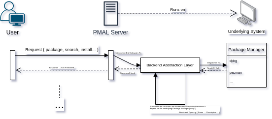

# Project Structure #

The root folder contains this file and the general files (e.g [LICENSE](LICENSE)), plus an [assets folder](assets) which is expected to contain images or other files in enriched formats to support the documentation of the project.

The project is contained into the [pmal folder](pmal).
It is a leinengein project and was built from the default template structure, which was then adjusted.

As is the default, the source code is contained in the [src folder](pmal/src) and the tests in the [test folder](pmal/test). The root folder of the project then contains the usual [project file](pmal/project.clj) and [gitignore](pmal/.gitignore).

The [src folder](pmal/src) contains three root namespaces.

* The [mock namespace](pmal/src/mock) is a small namespace that contains a small wrapper around clojure's [with-redefs-fn](https://clojuredocs.org/clojure.core/with-redefs-fn) used to mock some resources for testing purposes. It is self contained.
* The [interactive namespace](pmal/src/interactive) is the default repl namespace and contains some simple functions to streamline repl-experimentation. It depends on both the [mock namespace](pmal/src/mock) and the [pmal namespace](pmal/src/pmal).
* The [pmal namespace](pmal/src/pmal) contains the application logic. It depends on the [mock namespace](pmal/src/mock).

### The pmal namespace ###

The structure of the pmal namespace is somewhat involved ( probably more than it needs to ).

```text
├── backend
│   ├── core.clj
│   ├── mock.clj
│   └── packages
│       ├── core.clj
│       ├── packagemanagers
│       │   ├── core.clj
│       │   ├── dpkg.clj
│       │   └── pacman.clj
│       └── types.clj
├── core.clj
└── server
    ├── core.clj
    └── routes
        ├── api.clj
        └── core.clj
```

Generally, each namespace possesses a core source file that defines the interface of the component plus one or more files used to support the component logic.

The [top-level core file](pmal/src/pmal/core.clj) contains the main entry-point of the application and the setup needed for it.

The [server namespace](pmal/src/pmal/server) contains the server code, which runs on ring+reitit+jetty.
It is divided into a [core namespace](pmal/src/pmal/server/core.clj), which provides access to the main handler, and an internal [routes namespace](pmal/src/pmal/server/routes/), used by the [server's core namespace](pmal/src/pmal/server/core.clj), which provides the routing and the backend connection used by the server.

The [backend namespace](pmal/src/pmal/backend) contains the whole backend layer.
The [core namespace](pmal/src/pmal/backend/core.clj) provides a top level interface that is used by both the [server](pmal/src/pmal/server) and the [top level core file](pmal/src/pmal/core.clj).

The [mock namespace](pmal/src/pmal/backend/mock.clj) is designed to contain mocking functions used for the automated tests of the server.

The [packages namespace](pmal/src/pmal/backend/packages) is the layer that encapsulates access to the underlying system and its package manager.
Again, the [core namespace](pmal/src/pmal/backend/packages/core.clj) contains the top level interface and abstracts away the need to know about package manager to the rest of the backend.

The [types namespace](pmal/src/pmal/backend/packages/types.clj) provides the types used to work with packages managers. This file is expected to be refactored into the [packagemanagers namespace](pmal/src/pmal/backend/packages/packagemanagers) as that is the namespace which actually depends on it (Although this may change if a more thorough restructuring is brought forward).

The [packagemanagers namespace](pmal/src/pmal/backend/packages/packagemanagers) thus contains the logic required to connect to and interpret the system's package manager. For the current purposes two stub binding are provided for the dpkg and pacman package managers.

# Running the PMAL Server #

As it currently stands, the project is considered at most an in-development prototype and isn't expected to be deployed.

The project can be explored trough leinengein either in the repl or by running it.

1. Move to the [leinengein project directory](pmal). Either:
   * Run `lein run` to launch the server.
   * Run `lein repl` to launch a repl in the [interactive.core namespace](pmal/src/interactive/core.clj).
     * The [interactive.core namespace](pmal/src/interactive/core.clj) provides the following functions/macro:
       1. start-server/stop-server/restart-server [] - Start/Stop/Restart the server. The server can then be interacted with as if run by lein run. Those are the only functions in the interactive namespace that work with an actual server.
       2. request-to-server [route] - Sends a mock get-request to route. Does not interact with an actual instance of the server.
          * request-package [pkgname] - A specialization of request-to-server that asks for the details of pkgname.
      3. request-with-pacman/dpkg [request] - Sends a mock request in an environment where the underlying package manager is pacman/dpkg. Can be composed with request-to-server/request-package.
      
The server will run on localhost:8080 and can be contacted with the usual methods (e.g curl).

The server uses the :manager environment variable to decide which package manager to use in its backend.
For the current structure, this is provided trough leinengein+environ in the :env entry of the [project.clj file](pmal/project.clj).

The currently supported package managers are pacman and dpkg.

Currently, the server supports the following routes:

* /api/details/:pkgname :get - Requests the details of the package named :pkgname to the underlying package manager. Returns a 200 response with the following body {:package {:name :pkgname :description "..."}} if the package is known to the system. Returns a 404 response otherwise.

#  On Approaching the project #

## My impression on clojure ##

The clojure language was chosen in accordance with Reaktor as per the request of providing a project sample in a mainstream language.
Of the mainstream languages that were provided as choices, clojure was simply the one which interested me the most and which I already had an interest in studying.

My main sources of knowledge were [Fogus/Houser's { The Joy Of Clojure, Second Edition }](https://www.manning.com/books/the-joy-of-clojure-second-edition)(which I unfortunately only skimmed trough for now and need to find the time to read it accurately as it showed to merit) and the first few chapters plus appendix of [Sotnikov/Brown's { Web Development With Clojure, Third Edition Beta }](https://pragprog.com/book/dswdcloj3/web-development-with-clojure-third-edition), plus the online clojure documentation and dependency-specific documentation.

Clojure does not seem to provide any particularly innovative feature which helped me get into the language, having already seen or experienced most practices in other languages ( with some features that I known about but never really practiced before this project, e.g lisp-like macros ).

Both the basic structure of the language and its syntax ( while I'm not particularly fanatic about s-expr I must praise the readability and structure modeling features they provide ) and semantic feels incredibly compact and easy to get into at a basic level.

I'm particularly amazed by how pragmatically and with an eye to design clojure was packaged.

I think that this can be seen even at the clojure-developed-package-level. Everything I've used in clojure is an absolute pleasure.

In particular, the fact that all of this is done without sacrificing neither elegance nor expressiveness ( which is probably a product of lisp's legacy ) is out of this world.

At a basic level I'm simply amazed, but, obviously, I was able to at most scratch the surface and don't feel that I can provide an actually educated opinion of the language.

I must still say that it is probably a language that I wouldn't prioritize in my free time, but would surely prioritize in a work environment.

## Approaching the project and moving away from the original assignment ##

I've started the project with the study of clojure. As I usually do with new languages, I've started by trying to get an idea of what features are provided and then using them to build something simple.

I've used the original assignment as an initial project, modeled similarly to my previous factor assignment, which has let me get accustomed to the syntax, tooling and basics of the language.

When I work on projects in my free time, and those projects are neither small exercises nor domain-specific libraries, I build an imaginary context in which an application is developed ( as they say *"limitation breeds creativity"*) such that actual design decision and development compromises can both be made and emerge.

This is what I've done for this project too.

Before going on, please allow me to say that non-communicative important decisions which may hinder the team's dynamics if decided alone, are not how I usually work in a professional environment where this level of autonomy and discipline is not required and usually malicious.
Nonetheless, as the project was being built in my free time and the main point of doing it was personal growth, I've taken the liberty of doing it this way.

I consider that this actually enables you to better gauge the way in which I work and think about development, but I will more than understand if this is unacceptable to you and will impact my application negatively.

I've started with asking myself why was this product being built ( where product means "A server which will provide information about dpkg's packages.").

While it can be targeted to end-user, I find that the most approachable demographic for such a project are system administrators.

I don't see any particular utility in it. A sys-admini will probably find it easier to use something that is scriptable more than a frontend and will be accustomed to cl interfaces, meaning that the product probably has no way to provide an actually better UI.

While it is true that an alternative interface may help when the underlying interface is considered complex or not easily learnable ( e.g the many wrappers to git (mostly gui based) which seems to be used ), I find that it is difficult to consider most package managers interfaces user-hostile and don't think this is applicable, specifically, to dpkg.

The product could, maybe, look at providing feature-extensions to the underlying package manager but this is a whole can of worm which, unless specifically requested or if there is an actual reason that this is the most effective way to build whatever is needed, it would be quite difficult to justify in a business environment.

After some more considerations, I think that instead of posing the product as a contender of a particular package manager the whole package manager could be abstracted away by the product such that the main selling point would be generality ( There are many more possible context by I've settled on this as it provides many interesting decision points and is technically interesting ).

To further this concept, I've imagined the following narrative on which the product is built:

> Mr. Snowden, your company head of system administration, barges in your lonely room.
> "We have a problem which needs be solved" he says.
>
> Your company has recently created a new internal network of computers that provides many, many, many different
> distributions of GNU/Linux systems for testing purposes.
>
> The system administrators needs to automate some processes that deal with long-term package management on the newly
> installed systems but are having some difficulties regarding the centralization of the automation scripts and the 
> repetitiveness of it. 
>
> The system administrators started working on some system-specific scripts that will live in a known directory 
> and will be used to dispatch the automation to the system, but have come looking for you to simplify their work.
>
> After some back and forth you were able to build some user stories:
>
> As a user I want to manage the packages on a system irregardless of the underlying package management system.
>
> As a user I want to manage the packages on a system without physical access to it.
>
> As a user I want to find which packages are available.
>
> As a user I want to find the details of the packages available to the system.
>
>...
    
The proposed solution was thus the Package Manager Abstraction Layer.



PMAL should abstract the specifics of a package manager interface and provides a common api that can be automated towards.

The project was built on this assumption and the design decisions are mostly geared towards this objective ( with the caveat that the project is considered an exercise and thus is kept down in scope and acts at most as a POC ).


## The current state of the project and what I find abhorrent ##

The project is in a completely unfinished state, this is almost completely my fault as I've overestimated the hours that I could give to the project and the deadline of it ( real-life commitments has led to the need of moving the deadline before the initial expectation ).

An initial draft of the architecture emerges but I find it is unsatisfying.
In particular, on the structural level, in hindsight, the project feels too complex.

As I was working both in an unknown technology and an unknown domain, I've tried to divide the structure in as small as possible logical units, to help me develop different components in parallel and in parts.
I think that I've gone too much and too little towards that direction at the same time, breeding accidental complexity in the process.

There are many, many small files if we consider the actual scope of the current project. 

While the structure is still intended as per a planned final state, which means that the substance of many units will expand, the logical units feel dispersive. It is more difficult than necessary to maintain the whole structure in mind.

This is particularly evident in the current, few, error handling features. 

The deepest layers of the backend are highly coupled but are still being treated as separated.
Thus, repetitiveness was bred such that something in the deepest layer infects the whole pipeline ( e.g the nil infection from the packages and packagemanager layer ) regurgitating up to the server.

While a part of this is probably unavoidable without adding complexity, I feel that the structure can both be compressed and flattened removing some unnecessary repetition which is too error-prone.

Another example of this wrong structure is the [pmal.backend.packages.types namespace](pmal/src/pmal/backend/packages/types.clj) which should mostly be owned by the package managers and is currently misplaced.

There is a lack of documentation and good test suite. Part of this is desired, I mostly ignored some behaviors that are expected to change in a short time.
This is something that I may approach differently in a team environment depending on how the tasks are divided.

I particularly dislike the way in which tests often depend on some specific detail of a different component and would look to move away from this by better dividing the components (e.g the server could receive a backend entity instead of depending on it directly, and use its interface such that mocking can be better centralized.).

There is then a general ugliness in the code. I've seen clojure code that is simply beautiful and this is not the case.

Most of the implementation feels "fat" for what it actually does.

I didn't expect to be able to write idiomatic clojure in such a small time but an improvement at the atomic level of implementation has to be considered.

There is a general inelegance in this project at its current state and there are many things I could say needs to be improved on different granularity levels, but this is the hang of it from my point of view,

## On how I planned further development ##

### Structural slimming and the expansion of the PMAL-Package record ###

The next step in the project was in regard to slimming the structure of it and diminish dispersiveness.
I would start with a light refactoring that flattens the package and packagemangers namespaces.

I wouldn't dare to structurally refactor more at this particular step as I'd like to first gather more knowledge about the actual development of the application; expectations are often wrong.

After this, I expected to extend the amount of information that is extracted from the package managers and, thus, the PMAL-Package type.

As I'm missing some real use cases and do not have the expertise to actually provide them, I would try to use a greedy approach and extract as much information as possible.

This step will require a more thorough look at the format of different package managers as the data has to be abstracted into a general format.

I would explores queries such as "what kind of versioning system do different package managers use?", "Can different formats be homologated in a lossless way?" and so on.

In a real environment, where domain experts users would have provided use-cases they were interested in I would move this step earlier in the development process.

### Extending the api and use the newly acquired knowledge to better the server UX ###

There are two main point of extensionality in the application: 
* The features provided by the api.
* The supported package managers. 

I would start by adding to the api now that the possibly provided information are laid out. 

I would probably begin by substituting the single package query with a more general search.

This should provide me with a better understanding of how to structure the backend and improve the interactivity of the server.

It should further provide cleaning of the server-side error handling procedures and a deeper knowledge of it such that both structural and atomic design decision can be reevaluated.

### Doubling down on extending the api ###

The next expected step was to add a complex, interactive and mutable api-features such as install.

If I have to be a bit factitious, I would be super interested in building a multilayered api, where the installation procedure requires a multi-sequence of request and responses that is interactive, similarly to the experience of actually installing a package by using a package manager.

Unfortunately, this would go against the automation objective ( and is probably a bad design in a more general sense ).

I would thus look at simplifying the installation procedure such that user only has to ask for the package and then forget about it.

This is probably a complex step. There are many things that can go wrong in the installation and there are many premises that have to be handled ( e.g Does the server have the permission required to install a package? How can those permission be granted in a secure way [ probably not by simply running the server as a superuser for example ]? ).

I would use this particular step to clean up and define the correct error handling procedures.

For example, who is responsible for recovering from errors? Should the server continue running even if an error is provided? Should the response of an error be left the automation script that work as a client?

On a general note, I expect that most errors should not creep out to the client, which should simply be able to discern success or failure but not the particular reason for it as long as the request was semantically valid.

I think this is the correct approach as most errors that may arise at this point would need, probably, action either at the application level ( e.g a bug ) or at the system level ( e.g there isn't enough space to install the package ).

If this is the case, I would thus look to introduce a logging mechanism for the server.
We don't want the errors to creep out but we should still be able to examine them and a logging system would provide us with a way to do it without passing them to client.

As I usually do, there would be a general refactoring of code, tests and documentation while processing those steps, with a focus on the units touched in the particular step.

### Extending the package manager support and abstracting their implementation ###

At this point, the code would probably look completely different from what I actually expect it to look like; and much required knowledge would be acquired.

If I have to guess, the next step would be to simplify and generalize the system in which package managers are added to the system.

There are many possibilities here, from a complex plugin system to simply keeping the current system.

I think that at this point we would have found a general pattern in how package managers bindings are being implemented.
I would thus look in providing a dsl to build them. I expect it to look something like this:

```clojure
(Manager
    (:query "shell command" parser)
    (:install "shell command" interactionfn parser)))
```

Which would then expand to a type satisfying the current iteration of PackageManager,

At this point, error handling for the packagemanagers unit should be homologated ( which I expect to be a simple logging of the error output of the shell command and some kind of value that creeps to the server such that it can discern the failure and provide a general error response ).

I would here look into providing a good parsing procedure, probably a library like [instaparse](https://github.com/Engelberg/instaparse) as I expect a good deal of parsing will be needed ( If I have to be factitious, again, and considering a personal project, I would probably pause the project and work on small parsing library for clojure as I am looking for an excuse to read about [peg parsers](https://bford.info/packrat/) and  [Grune/Jacobs { Parsing Techniques: A Practical Guide (Monographs in Computer Science) }](https://www.amazon.com/Parsing-Techniques-Practical-Monographs-Computer/dp/038720248X/ref=sr_1_1?dchild=1&keywords=parsing&qid=1585691894&sr=8-1)),

At this point the structure of the application would probably be complete and I would look at general improvement and refactoring while building feature-completeness ( as described by the actual client or designed based on the problem he has to resolve ) in parallel.

On a general level this is what I planned to develop.

With the initially-expected deadline, the free time I expected to be able to gather for this assignment and the pace at which I was going I expected to go as far as the [Doubling down on extending the api](#doubling-down-on-extending-the-api) step.
